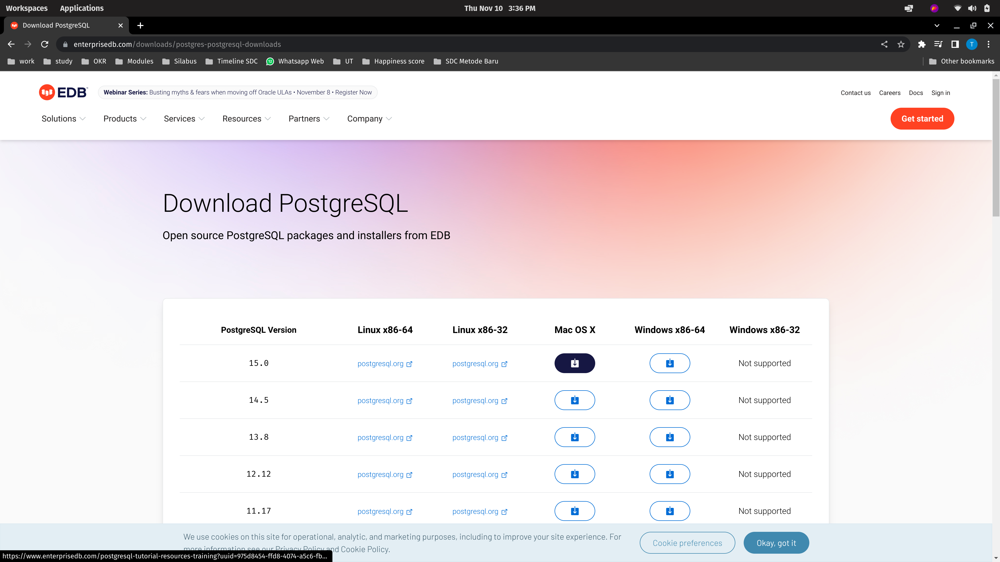

# PostgreSQL

## Windows

Download installer di [Download PostgreSQL](https://www.enterprisedb.com/downloads/postgres-postgresql-downloads) lalu pilih Windows.


Ikuti instalasi sampai selesai.

## Mac

Download installer di [Download PostgreSQL](https://www.enterprisedb.com/downloads/postgres-postgresql-downloads) lalu pilih Windows.



Ikuti instalasi sampai selesai.

## Linux

Pergi ke [PostgreSQL: Downloads](https://www.postgresql.org/download/) untuk memilih Distro OS.


Contoh Ubuntu, eksekusi perintah berikut.

```bash
sudo sh -c 'echo "deb http://apt.postgresql.org/pub/repos/apt $(lsb_release -cs)-pgdg main" > /etc/apt/sources.list.d/pgdg.list'

wget --quiet -O - https://www.postgresql.org/media/keys/ACCC4CF8.asc | sudo apt-key add -

sudo apt-get update

sudo apt-get -y install postgresql
```

# Python

## Windows

Pergi ke [Python Release Python 3.11.0 | Python.org](https://www.python.org/downloads/release/python-3110/) lalu pilih Windows Installer.


Ikuti instalasi sampai selesai.

## Mac

Pergi ke [Python Release Python 3.11.0 | Python.org](https://www.python.org/downloads/release/python-3110/) lalu pilih Windows Installer.


Ikuti instalasi sampai selesai.

## Linux

Eksekusi perintah berikut.

```bash
sudo apt-get update

sudo apt-get install python3
```

# Jupyter Notebook

Eksekusi perintah berikut.

```bash
pip install jupyterlab
```

# Java

## Windows

1. Pergi ke https://www.java.com/en/download/manual.jsp dan pilih installer.
   
   

2. Setelah download selesai, instal dengan double-click installer tersebut. Ikuti langkah hingga selesai.
   
   

3. Untuk menambahkan PATH, lihat artikel berikut [How to Install Java on Windows {Step-by-Step Guide}](https://phoenixnap.com/kb/install-java-windows)

## Mac

1. Pergi ke https://www.java.com/en/download/manual.jsp dan pilih DMG installer.
   
   

2. Setelah download selesai, instal dengan double-click installer tersebut. Ikuti langkah hingga selesai.
   
   

3. Set JAVA_HOME menggunakan perintah berikut.
   
   `export JAVA_HOME=/Library/Java/Home`

## Linux

1. Install menggunakan perintah berikut.
   
   ```bash
   sudo apt update
   sudo apt-get install openjdk-8-jdk -y
   ```

2. Set JAVA_HOME menggunakan perintah berikut.
   
   `export JAVA_HOME=/usr/lib/jvm/java-8-openjdk-amd64/`

# PySpark

Eksekusi perintah berikut.

```bash
pip install pyspark
```

# Airflow

Eksekusi perintah berikut.

```bash
pip install "apache-airflow[celery]==2.4.2" --constraint "https://raw.githubusercontent.com/apache/airflow/constraints-2.4.2/constraints-3.7.txt"
```

# Scrapy

Eksekusi perintah berikut.

```bash
pip install Scrapy
```

# Selenium

Eksekusi perintah berikut.

```bash
pip install selenium
```

# Selenium WebDriver

| Web Browser       | Download Link                                                                     |
| ----------------- | --------------------------------------------------------------------------------- |
| Chromium/Chrome   | [Download](https://chromedriver.storage.googleapis.com/index.html)                |
| Firefox           | [Download](https://github.com/mozilla/geckodriver/releases)                       |
| Edge              | [Download](https://developer.microsoft.com/en-us/microsoft-edge/tools/webdriver/) |
| Internet Explorer | [Download](https://selenium-release.storage.googleapis.com/index.html)            |
| Safari            | Built-in                                                                          |
| Opera             | [Download](https://github.com/operasoftware/operachromiumdriver/releases)         |

Atau untuk lebih lengkapnya bisa mampir ke dokumentasi resmi Selenium [di sini](https://www.selenium.dev/documentation/en/webdriver/driver_requirements/#quick-reference).